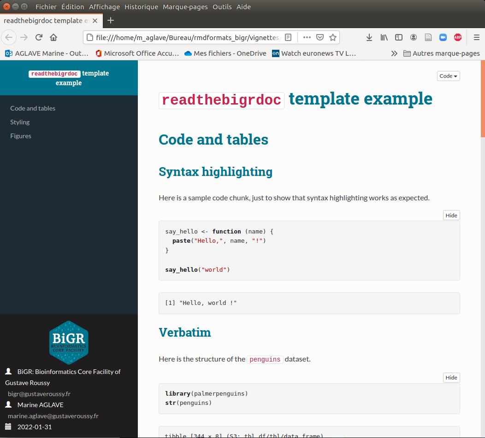

# rmdformats_bigr

This R package provides ready-to-use HTML output template for
RMarkdown documents.

## Format gallery

### `readthebigrdoc`
This template is inspired from `readthedown` template from [rmdformats](https://github.com/juba/rmdformats) package, itself adapted from the corresponding `readtheorg` theme of the [org-html-themes](https://github.com/fniessen/org-html-themes) project, fully responsive with dynamic table of contents and collapsible navigation.

[](https://gitlab.com/bioinfo_gustaveroussy/bigr/rmdformatsbigr/-/blob/main/vignettes/examples/readthebigrdoc.html)

## Helpers

It provides the `pilltabs()` helper function, which allows to display a crosstab dynamically. See [one of the output samples](https://gitlab.com/bioinfo_gustaveroussy/bigr/rmdformatsbigr/-/blob/main/vignettes/examples/readthebigrdoc.html#table) for a live example.

## Installation

You can install the latest release from Github :

```r
install.packages("remotes")  # if necessary
install.packages("git2r")
remotes::install_git("https://github.com/sandratra-rab/rmdformatsbigr.git",
             credentials=git2r::cred_user_pass("your_login", "your_password"))
```

## Creating a new document

Just create a new `Rmd` file and add the following in your YAML preamble :

```yaml
---
output: rmdformatsbigr::readthebigrdoc
---
```

## Options

Depending on the features provided by the template, you can add the following options to your YAML preamble. Look at the template function help page for a valid list :

- `fig_width` : figures width, in inches
- `fig_height` : figures height, in inches
- `fig_caption` : toggle figure caption rendering
- `highlight` : syntax highlighting
- `thumbnails` : if TRUE, display content images as thumbnails
- `lightbox` : if TRUE, add lightbox effect to content images
- `gallery` : if TRUE, add navigation between images when displayed in lightbox
- `use_bookdown` : if TRUE, will use `bookdown` instead of `rmarkdown` for HTML rendering, thus providing section numbering and [cross references](https://bookdown.org/yihui/bookdown/cross-references.html).
- `embed_fonts` : if `TRUE` (default), use local files for fonts used in the template instead of links to Google Web fonts. This leads to bigger files but ensures that the fonts are available
- additional aguments are passed to the base `html_document` RMarkdown template

Example preamble :

```yaml
---
title: "My document"
date: "`r Sys.Date()`"
author:
  - name: "BiGR: Bioinformatics Core Facility of Gustave Roussy"
    email: "bigr@gustaveroussy.fr"
  - name: "Marine AGLAVE"
    email: "marine.aglave@gustaveroussy.fr"
output:
  rmdformatsbigr::readthebigrdoc:
    code_folding: show
    thumbnails: false
    lightbox: false
---
```

## Credits

- [Magnific popup](https://dimsemenov.com/plugins/magnific-popup/) lightbox plugin.
- The CSS and JavaScript for `readthebigrdoc` is adapted from the corresponding `readthedown` template from the [rmdformats](https://github.com/juba/rmdformats) package, which is itself inspired by the `readtheorg` theme of the [org-html-themes](https://github.com/fniessen/org-html-themes) project, which is itself inspired by the [Read the docs](https://readthedocs.org/) [Sphinx](http://sphinx-doc.org/) theme.
- JavaScript and HTML code for code folding and tabbed sections are taken from the RStudio's default `rmarkdown` HTML template.

